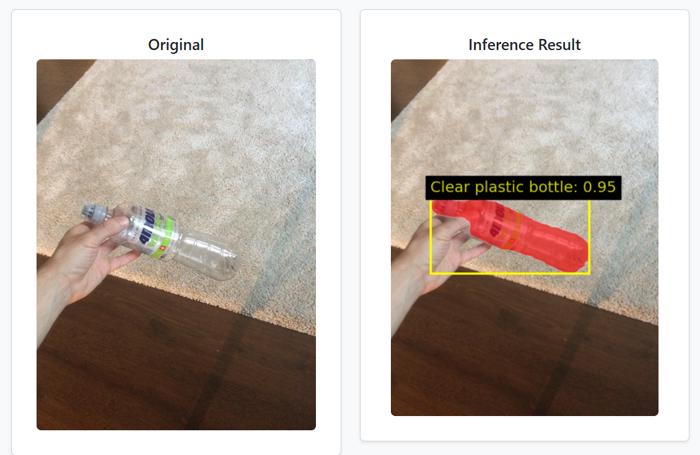
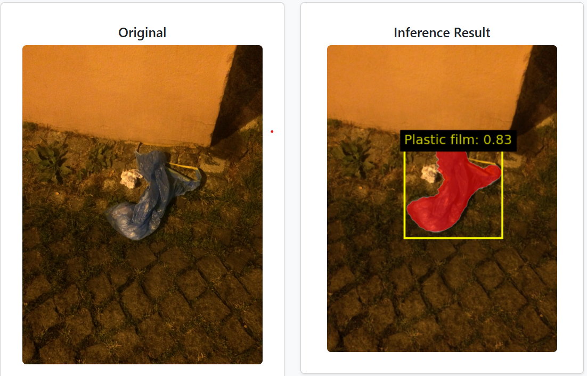

# Instance Segmentation for Waste Classification

This project implements a fine-tuned Mask R-CNN model with a ResNet-50 backbone for instance segmentation, tailored for real-world waste classification. Leveraging the TACO (Trash Annotations in Context) dataset—which provides annotations for over 59 distinct waste-related categories—the model is trained and optimized to detect and segment various types of waste under diverse environmental conditions. The project encompasses complete data preprocessing, training with fine-tuned hyperparameters, thorough evaluation using segmentation metrics, and a production-ready MLOps pipeline with a real-time web application for interactive inference.

---

## Table of Contents

- [Overview](#overview)  
- [Dataset](#dataset)  
- [Model Architecture](#model-architecture)  
- [Training Setup](#training-setup)  
- [Evaluation Metrics](#evaluation-metrics)  
- [MLOps Pipeline](#mlops-pipeline)  
- [Web Application](#web-application)  
- [Results](#results)  
- [Conclusion](#conclusion)

---

## Overview

The goal of this project is to develop a robust instance segmentation model capable of accurately identifying and classifying waste in diverse, real-world environments. By combining state-of-the-art deep learning techniques with a scalable deployment pipeline, the system provides an efficient and practical solution for automated waste monitoring and smart waste management.

---

## Dataset

- **Source:** [TACO Dataset](https://tacodataset.org/)
- **Selected Classes:** Plastic, Landfill, Organic (subset selected from 59+ annotated categories)

### Preprocessing Steps:
- Removed masks smaller than **4×4 pixels**
- Filtered out low-visibility objects (bounding box visibility < 30%)

### Augmentations:
- Applied using **Albumentations**
  - Geometric transforms: horizontal/vertical flips, random rotations, scaling transformations.
  - Photometric transforms: brightness/contrast adjustment, gamma correction, hue/saturation shifts.

---

## Model Architecture

- **Base Model:** Mask R-CNN with ResNet-50 + Feature Pyramid Network (FPN)
- **Library:** PyTorch (`torchvision.models.detection`)
- **Customizations:**
  - Fine-tuned for waste classification using a subset of the TACO dataset.
  - Model Workflow:
      - Region Proposal Network (RPN): Generates candidate object regions.
      - ROIAlign: Extracts aligned feature maps for each proposed region.
      - Task-specific heads:
          - Bounding Box Head: Refines the spatial coordinates of each object.
          - Classification Head: Predicts the waste type (Plastic, Landfill, Organic).
          - Mask Head: Produces a binary segmentation mask for each detected object.

---

## Training Setup

- **Input size:** 512 × 512  
- **Epochs:** 60  
- **Batch size:** 4  
- **Optimizer:** SGD with 0.9 momentum  
- **Learning Rate:** OneCycleLR (max LR = 5e-3, cosine annealing)  
- **Regularization:** Weight decay = 5e-4  
- **Losses:** Combined classification, bbox regression, and binary mask loss  
- **Device:** Trained on NVIDIA T4 GPU (Vertex AI)

---

## Evaluation Metrics

### 1. Fixed IoU Threshold (0.5)
- Precision
- Recall
- Mean Intersection over Union (mIoU)
- Class Accuracy

**Insight:**  
The evaluation was conducted using a 0.5 IoU threshold, which provided the most stable and reliable performance results. The model achieved strong segmentation accuracy and classification consistency, especially on clearly visible and well-separated waste items.

---

## MLOps Pipeline

- **Version Control:** Managed through GitHub for collaborative development and tracking.

- **Training Jobs:** Executed on Vertex AI Custom Jobs using T4 GPU instances.

- **CI/CD:** Automated with Cloud Build triggers for model training and app deployment.

- **Containerization:** Model and web app containerized using Docker for consistent builds and deployment.

- **Model Storage:** Best-performing model (based on validation mIoU) is saved automatically to Google Cloud Storage for versioning and reuse.

- **Deployment:** The containerized model is deployed using Cloud Run for scalable, serverless inference.

---

## Web Application

- **Framework:** Flask  
- **Features:**
  - Upload images through a user-friendly interface
  - Run real-time inference using the trained segmentation model
  - Visualize instance masks with class labels overlayed on the image
- **Model Loading:** Downloads the best-performing model from Google Cloud Storage at startup for inference
- **Deployment:** Dockerized to ensure environment consistency across local development and cloud deployment. The app is hosted using Cloud Run for scalable, serverless inference.

---

## Results

### Quantitative Metrics (IoU = 0.5)

| Metric                     | Value         |
|---------------------------|---------------|
| **Training mIoU**         | 0.827         |
| **Validation mIoU**       | 0.818         |
| **Training Accuracy**     | 0.820         |
| **Validation Accuracy**   | 0.653         |
| **Training Time**         | ~7 hours (60 epochs) |
| **Avg. Time per 10 Epochs** | ~1 hr 10 min |

### Qualitative Results

Below are sample visualizations of model input and output:

  
  

---

## Conclusion

This project demonstrates the successful development of a deep learning model for waste classification using instance segmentation. The fine-tuned Mask R-CNN achieved strong accuracy and generalization, making it suitable for deployment in diverse environments. With a robust MLOps pipeline and a functional web application, this system can serve as a foundation for smart waste detection solutions at scale.
